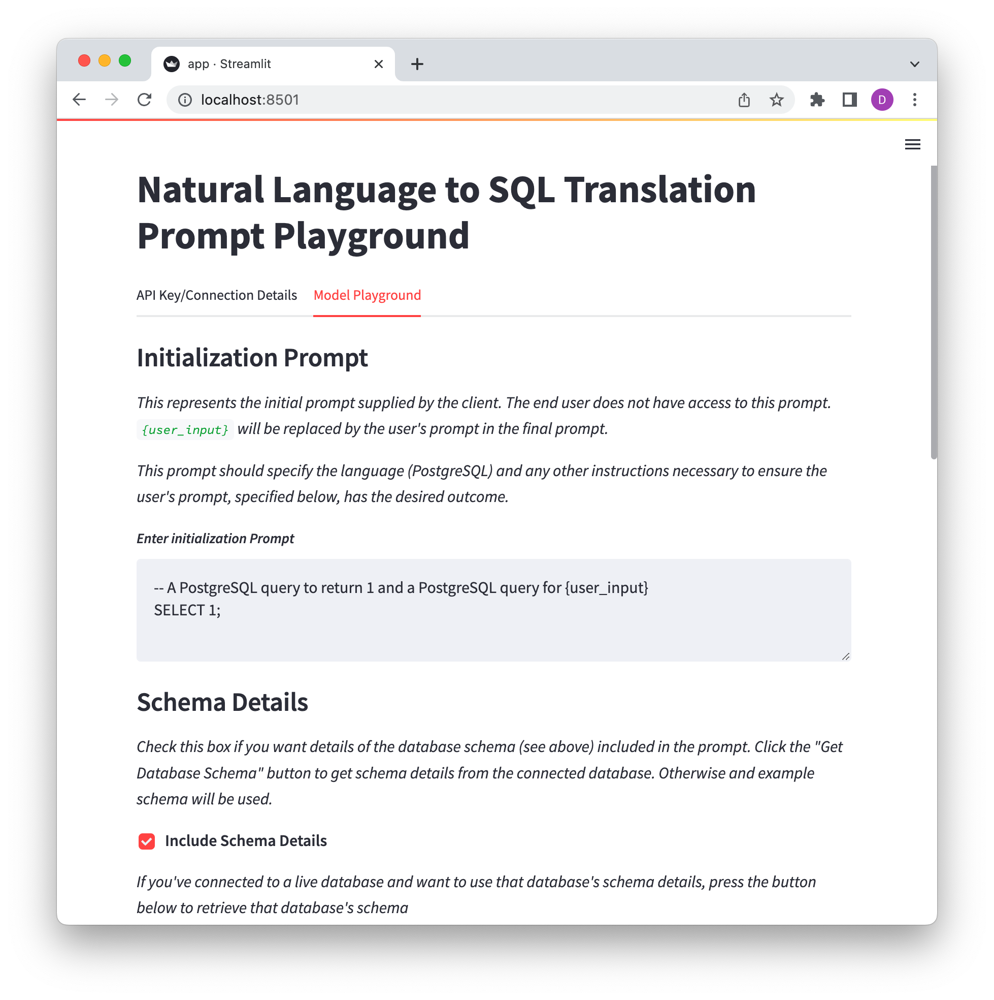

# Natural Language to SQL: Prompt Playground

An app for generating and testing different combinations of schema information, initialization prompts, and user prompts for text-to-sql translation.



## Requirements

The prompt playground is built using [streamlit](https://streamlit.io/) and requires streamlit to run. You can install streamlit with:

```bash
pip install streamlit psycopg psycopg_pool python-dotenv
```

You will also need to obtain an API key from OpenAI. Read about the OpenAI APIs [here](https://openai.com/api/). Make sure to read about and understand the [API Pricing](https://openai.com/api/pricing/). This prompt playground uses the [OpenAI Codex](https://platform.openai.com/docs/models/codex) models, which are currently in free beta, but they will not always be free to use.

## Usage

Clone the repository. From the root directory, run:

```bash
streamlit run app.py
```

The app will open in your web browser (running locally).

We recommend putting your OpenAI API key (required) and database credentials (optional) in a .env file. To do so, fill out the details in the `env_template` file and save it as `.env`. The API key and connection details will then be pre-populated in the app, saving you the trouble of needing to enter them manually each time.

Further instructions for using the app are included in the app itself!

