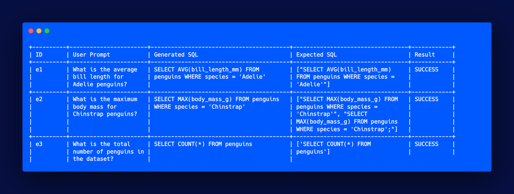

# Testing Text-to-SQL Translation



The testing system is designed to test the accuracy of a text-to-SQL
translation model. It generates SQL queries from natural language
prompts and compares them to expected outputs.

## Requirements:
- Python 3.6+
- openai library
- dotenv library
- prettytable library
- termcolor library
- PostgreSQL

## Setup:
- Clone the repository and navigate to the root directory
- Install the required libraries
- Create a .env file in the root directory with your PostgreSQL credentials (see `env_template` in the project root for an example)

## Usage:
To run the testing system, run the following command in the test_prompts directory:

`python test_prompts.py --config-file <path_to_config_file> --log-file <path_to_log_file>`

The `--config-file` argument is used to specify the YAML configuration file for the test. See config_template.yaml for an example.

The `--log-file` argument is used to specify the destination for the test logs. If the file already exists, new logs will be appended to the existing file. If this argument is not specified, the logs will only be printed to the terminal.

The results of the test will be printed to the terminal in a pretty table format. The log file will contain a JSON object with the following keys:

- test_name: the name of the test (default is "unnamed")
- timestamp: the date and time the test was run
- config_file: the path to the configuration file used for the test
- task_prompt: the prompt used for the test
- model_params: the additional model parameters used for the test
- total: the total number of test cases run
- successful: the number of test cases that were successful
- results: a list of dictionaries containing the details of each test case, including the prompt, the generated SQL query, the expected output, and whether the test was successful.

### Test Configuration

The test configuration is defined in a YAML file and has several sections that can be used to customize the testing process:

- `name`: A string that provides a name for the test, which will be used in the log file.
- `model`: Specifies the type of model to use and its parameters. In the example below, a single-turn (as opposed to chat) model is used with temperature set to 0.0, n set to 1, and stop set to ';'.
- `test_cases`: Specifies the location of the test cases to use. It also specifies the category of tests to use.
- `prompt`: Specifies the template for the SQL prompt that will be used to generate the queries. The template includes a schema placeholder that will be replaced with the JSON schema loaded from the test case file and a user_prompt placeholder that will be replaced with the test prompt. In this example, the template includes a simple SELECT 1 query and the user prompt.


```yaml
name: test_codex
model:
  type: single
  params:
    temperature: 0.0
    n: 1
    stop: ';'
test_cases:
  filename: test_prompts.json
  category: easy
prompt:
  template: |-
    -- language PostgreSQL
    -- schema:
    {schema}

    -- be sure to properly format and quote identifiers.
    -- A postgreSQL query to SELECT 1 and a syntactically-correct PostgreSQL query to {user_prompt}
    SELECT 1;
```

The `prompt_template` is the primary part actually tested, so setting it up correctly is important. It must have placeholders for the schema and the user prompt, formatted `{schema}` and `{user_prompt}`; these will be replaced by the correct schemas and user prompts in the tests.

### Test Prompts

The test prompts are defined as a JSON file that contains a list of dictionaries. Each dictionary represents a test case and has the following fields:

- `id`: a unique identifier for the test case.
- `prompt`: the natural language prompt to be translated to SQL. This will replace the `{user_prompt}` placeholder in the prompt template.
- `expected_outputs`: a list of valid SQL queries that satisfy the prompt.
- `schema`: the name of the JSON file that describes the database schema used in the query.
- `explanation` (optional): a brief explanation of the purpose of the test case.
- The JSON file can be organized into categories, enabling you to run subsets of the tests. The category of test cases to be used in a test run is specified in the test configuration YAML file using the category field under `test_cases`. The file containing the test prompts is specified in the same YAML file using the filename field under `test_cases`.

The schema file specified for each test case is a JSON file that describes the database schema used in the test case. The schema should be defined in accordance with the conventions of the pg_text_query library used in the testing system.
